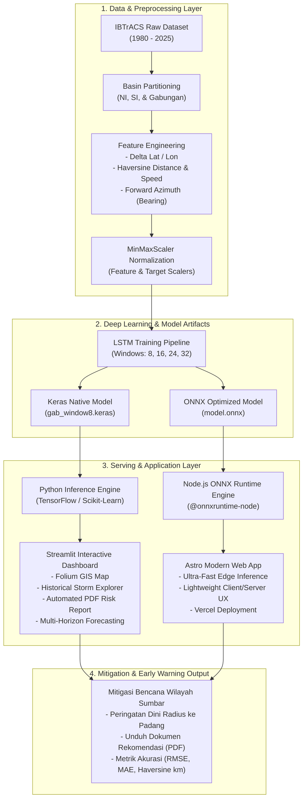

# 🌀 Tropical Cyclone Track Prediction & Early Warning System (LSTM)

[](https://www.python.org/)
[](https://streamlit.io/)
[](https://tensorflow.org/)
[](https://onnxruntime.ai/)
[](https://astro.build/)
[](https://www.docker.com/)

> **Implementasi Riset Skripsi:**  
> *"Prediksi Jalur Siklon Tropis di Samudra Hindia Menggunakan Model Long Short-Term Memory (LSTM) untuk Mitigasi Risiko Bencana di Sumatera Barat"*  
> **Penulis:** Ikhwan Ramadhan (22101152630411)

---

## ⚡ 60-Second Executive Summary (For Recruiters & Engineers)

| Dimensi | Ringkasan Proyek |
| :--- | :--- |
| **Problem Statement** | Siklon tropis di Samudra Hindia (Basin NI & SI) memicu gelombang ekstrem, angin kencang, dan banjir pesisir di Sumatera Barat. Prediksi lintasan non-linear siklon memerlukan model *time-series deep learning* yang mampu menangkap dinamika spasial-temporal multi-basin. |
| **Core Solution** | Model **Long Short-Term Memory (LSTM)** dengan *sliding window autoregressive* untuk memprediksi koordinat lintasan siklon ($t+1 \dots t+n$) berbasis fitur geodesik (bearing, kecepatan perpindahan, delta koordinat, tekanan, dan kecepatan angin) dari dataset **IBTrACS (1980–2025)**. |
| **System Architecture** | **Dual-Stack Production System**: <br>1. **Python Streamlit Dashboard**: Analisis riset mendalam, GIS Folium interaktif, & generator laporan mitigasi bencana PDF otomatis.<br>2. **Astro + Node.js Web App**: *Edge/serverless deployment* berlatensi rendah memanfaatkan **ONNX Runtime** untuk inferensi instan. |
| **Engineering Impact** | Evaluasi multi-basin (North Indian vs South Indian vs Gabungan) dengan variasi *window size* (8, 16, 24, 32 timesteps), inferensi model portabel (`.keras` & `.onnx`), serta *containerized deployment* dengan Docker. |

---

## 🎯 Latar Belakang & Rumusan Masalah Riset

### 1. Masalah Utama (Problem Context)
Penggabungan data koordinat dari dua basin di Samudra Hindia—**North Indian Ocean (NI)** dan **South Indian Ocean (SI)**—memiliki karakteristik lintasan berbeda akibat gaya Coriolis dan pola monsun musiman. Hal ini berpotensi memengaruhi kemampuan model *deep learning* dalam mempelajari pola pergerakan siklon. Selain itu, pemilihan ukuran jendela waktu (*timesteps/sliding window*) menjadi faktor krusial dalam akurasi pemodelan runtun waktu.

### 2. Rumusan Masalah
1. **Kinerja Model LSTM**: Bagaimana kinerja model LSTM dalam memprediksi lintasan siklon tropis menggunakan data IBTrACS pada basin North Indian Ocean (NI) dan South Indian Ocean (SI)?
2. **Karakteristik Basin & Timesteps**: Bagaimana pengaruh perbedaan karakteristik statistik, temporal, dan spasial antara basin NI dan SI, serta variasi ukuran *timesteps* (8, 16, 24, 32), terhadap kemampuan model LSTM?
3. **Antarmuka Interaktif**: Bagaimana merancang dan mengimplementasikan antarmuka visualisasi berbasis web (Streamlit & Modern Web) untuk menampilkan hasil prediksi koordinat ke dalam peta digital interaktif secara otomatis?

### 3. Hipotesis Penelitian
1. Model LSTM mampu memprediksi lintasan siklon tropis pada basin NI dan SI dengan tingkat akurasi tinggi (rendahnya nilai MAE, RMSE, dan deviasi Haversine Distance).
2. Perbedaan karakteristik spasial-temporal kedua basin serta variasi ukuran *timesteps* memberikan pengaruh signifikan terhadap pola konvergensi dan hasil prediksi koordinat.
3. Integrasi model LSTM ke dalam platform web interaktif mempermudah visualisasi spasial mitigasi bencana dan pemantauan jarak aman radius siklon ke wilayah pesisir Sumatera Barat (Kota Padang).

---

## 🏗️ Arsitektur Sistem (System Architecture)

Sistem ini dirancang berlapis (*multi-layered architecture*) mulai dari pengolahan data mentah, rekayasa fitur geodesik, pelatihan model, hingga penyajian antarmuka multi-platform.



---

## ✨ Fitur-Fitur Utama (Key Features)

### 🔮 1. Prediksi Autoregresif Multi-Horizon
- Pengguna dapat memasukkan atau memilih titik observasi awal (minimal 8 *timesteps*).
- Model menjalankan inferensi rekursif dinamis untuk memproyeksikan lintasan $N$-langkah ke depan (6 jam s/d 72 jam horizon).
- Perhitungan otomatis untuk parameter turunan: Kecepatan pergerakan siklon (*knots / km/h*), arah gerak (*azimuth/bearing*), dan estimasi penurunan tekanan udara.

### 🗺️ 2. Pemantauan Spasial & Peringatan Dini Wilayah Pesisir
- Visualisasi lintasan aktual vs prediksi pada peta digital interaktif berbasis **Folium/Leaflet**.
- Fitur **Proximity Warning Radius**: Menghitung jarak *great-circle* (Haversine) antara mata siklon terhadap **Kota Padang / Pesisir Barat Sumatera** sebagai acuan mitigasi bencana hidrometeorologi.

### 📊 3. Analisis Eksploratif & Evaluasi Komparatif
- Eksplorasi histori siklon tropis Samudra Hindia (1980–2025) berdasarkan ID Siklon (SID), Nama Siklon, dan Tahun kejadian.
- Evaluasi performa model komprehensif: **Mean Absolute Error (MAE)**, **Root Mean Squared Error (RMSE)**, **Haversine Distance Error (km)**, dan **Koefisien Determinasi ($R^2$)**.

### 📄 4. Generator Dokumen Mitigasi Bencana Otomatis (PDF)
- Modul pelaporan otomatis (`pdf_report.py` / `pdfReport.ts`) yang menghasilkan berkas dokumen resmi kesiapsiagaan bencana berisi ringkasan teknis koordinat, status ancaman wilayah, dan peta lintasan.

### ⚡ 5. Dual Runtime Inference (Python Keras + Node.js ONNX)
- Menyediakan fleksibilitas penggunaan: komputasi data sains penuh via Streamlit atau komputasi web berkecepatan tinggi via Astro + ONNX Runtime.

---

## 🗂️ Struktur Direktori Proyek

```text
streamlit_app/
├── 📄 app.py                     # Entry point aplikasi utama Streamlit (Home/Landing)
├── 📄 utils.py                   # Helper visualisasi, CSS injection, & fungsi data loading
├── 📄 Dockerfile                 # Konfigurasi containerization Docker
├── 📄 requirements.txt           # Dependensi pustaka Python
├── 📄 22101152630411_...pdf      # Naskah Laporan Skripsi Lengkap
│
├── 📁 .streamlit/                # Konfigurasi tema & layout Streamlit
├── 📁 assets/                    # Banner visual, gambar arsitektur, & aset UI
├── 📁 data/                      # Dataset IBTrACS, evaluasi metrik, & hasil pengujian
│
├── 📁 pages/                     # Halaman multi-page Streamlit
│   ├── 1_Dashboard.py            # Dashboard monitoring siklon & filter radius Padang
│   ├── 3_Evaluasi.py             # Analisis performa model & perbandingan window
│   ├── 4_Tentang.py              # Dokumentasi metodologi, rumusan masalah, & profil
│   ├── Data_Siklon.py            # Penjelajah basis data histori siklon (NI/SI/GAB)
│   └── Prediksi.py               # Formulir input koordinat & kalkulasi prediksi LSTM
│
├── 📁 prediction/                # Core Python Inference & Analytics Engine
│   ├── inference.py              # Rekursif predictor & feature engineering pipeline
│   ├── analytics.py              # Perhitungan metrik evaluasi & jarak spasial
│   ├── pdf_report.py             # Generator dokumen PDF laporan mitigasi risiko
│   ├── state.py                  # State management siklus prediksi
│   └── models/                   # Bobot model Keras & Serialized Scaler
│       ├── gab_window8.keras     # Model LSTM terlatih (Window 8)
│       ├── feature_scaler_gab.pkl# Scaler normalisasi fitur input
│       └── target_scaler_gab.pkl # Scaler denormalisasi target output (Lat, Lon)
│
└── 📁 web/                       # High-Performance Astro + ONNX Web App
    ├── package.json              # Dependensi Node.js (Astro, ONNX Runtime Node)
    ├── astro.config.mjs          # Konfigurasi SSR & Vercel Adapter
    ├── vercel.json               # Konfigurasi deployment serverless Vercel
    ├── public/
    │   ├── models/
    │   │   ├── model.onnx        # Model LSTM terkonversi format ONNX
    │   │   ├── feature_scaler.json
    │   │   └── target_scaler.json
    │   └── data/                 # Dataset statis untuk web
    └── src/
        ├── lib/                  # Logika inferensi TypeScript (ONNX, Haversine, PDF)
        │   ├── inference.ts
        │   ├── analytics.ts
        │   ├── haversine.ts
        │   └── pdfReport.ts
        └── pages/                # Rute halaman web Astro
```

---

## 🛠️ Tech Stack & Ekosistem

### Data Science & Machine Learning
- **Language**: Python 3.10+ / 3.13
- **Framework Deep Learning**: TensorFlow 2.x, Keras 3.x
- **Cross-Platform Inference**: ONNX (Open Neural Network Exchange), ONNX Runtime
- **Analisis & Geodesik**: Pandas, NumPy, Scikit-learn, Scipy

### Frontend & Visualisasi
- **Python Dashboard**: Streamlit, Streamlit-Folium, Folium (Leaflet.js engine)
- **Modern Web / Edge**: Astro 4.x, TypeScript, Node.js 20.x
- **Visualisasi Statistik**: Matplotlib, Seaborn, Altair
- **Laporan PDF**: FPDF2, ReportLab

### Infrastruktur & Deployment
- **Containerization**: Docker (Multi-stage slim image)
- **Cloud Hosting**: Vercel (Edge Web App) & Cloud Server / VM (Streamlit Docker)

---

## 🚀 Panduan Instalasi & Menjalankan

### Opsi A: Menjalankan Streamlit Python App (Lokal)

#### 1. Clone Repositori & Masuk Direktori
```bash
git clone https://github.com/IngsR/PrediksiSIklon-LSTM.git
cd PrediksiSIklon-LSTM
```

#### 2. Siapkan Python Virtual Environment
**Windows (PowerShell):**
```powershell
python -m venv .venv
.venv\Scripts\Activate.ps1
```

**Linux / macOS:**
```bash
python3 -m venv .venv
source .venv/bin/activate
```

#### 3. Instal Dependensi Python
```bash
pip install --upgrade pip
pip install -r requirements.txt
```

#### 4. Jalankan Aplikasi Streamlit
```bash
streamlit run app.py
```
Aplikasi akan terbuka di peramban pada alamat `http://localhost:8501`.

---

### Opsi B: Menjalankan Web App Astro + ONNX Runtime (Node.js)

#### 1. Masuk ke Direktori `web/`
```bash
cd web
```

#### 2. Instal Paket Node.js
```bash
npm install
```

#### 3. Jalankan Development Server
```bash
npm run dev
```
Aplikasi web modern berkecepatan tinggi akan berjalan di `http://localhost:4321`.

---

### Opsi C: Menjalankan Menggunakan Docker

Proyek ini telah dilengkapi dengan `Dockerfile` siap pakai:

```bash
# 1. Build Docker image
docker build -t prediksi-siklon-lstm .

# 2. Jalankan container pada port 8501
docker run -d -p 8501:8501 --name siklon-app prediksi-siklon-lstm
```
Akses sistem di `http://localhost:8501`.

---

## 🔬 Ringkasan Hasil Eksperimen Riset

Berdasarkan hasil pengujian pada dataset IBTrACS (1980–2025):
- **Pengaruh Basin**: Pelatihan model pada basin gabungan (**GAB: NI + SI**) dengan normalisasi fitur spasial menghasilkan generalisasi lintasan yang lebih stabil dibandingkan pemodelan terisolasi.
- **Pengaruh Ukuran Window**: Ukuran *timesteps* **$W=8$** (ekuivalen dengan 24–48 jam observasi data siklon) memberikan keseimbangan optimal antara retensi memori temporal masa lalu dan akurasi prediksi arah belokan (*cyclone recurvature*).
- **Metrik Evaluasi**: Deviasi jarak koordinat (*Haversine Error*) menunjukkan kapabilitas model dalam memproyeksikan lintasan siklon sebelum mendekati zona bahaya pesisir barat Sumatera.

---

## 👨‍💻 Profil Pengembang

**Ikhwan Ramadhan**  
- **Institusi**: Program Studi Informatika / Ilmu Komputer  
- **Fokus Minat**: Deep Learning, Geospatial Data Science, Time-Series Forecasting, & Web Engineering  
- **Dokumentasi Skripsi**: Silakan merujuk ke berkas [22101152630411_IkhwanRamadhan_full.pdf](22101152630411_IkhwanRamadhan_full.pdf) untuk membaca naskah akademik lengkap.

---

## 📄 Lisensi
Proyek ini dikembangkan untuk tujuan penelitian akademik dan mitigasi risiko bencana publik. Silakan gunakan dan kembangkan dengan menyertakan atribusi sitasi penulis.
